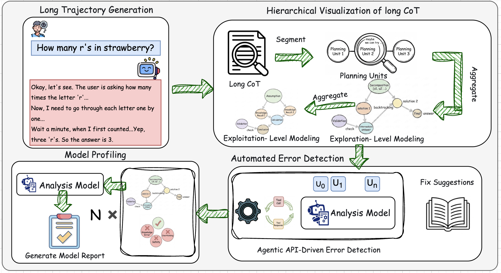
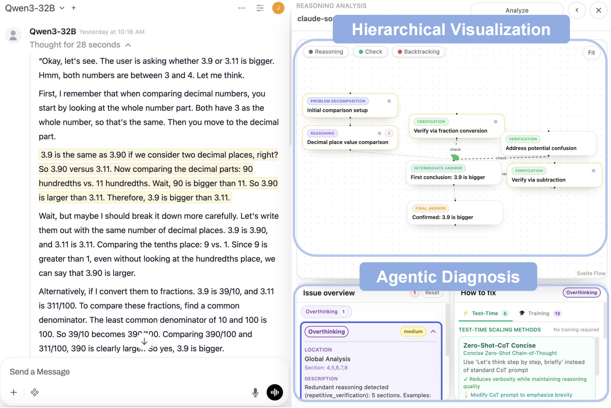
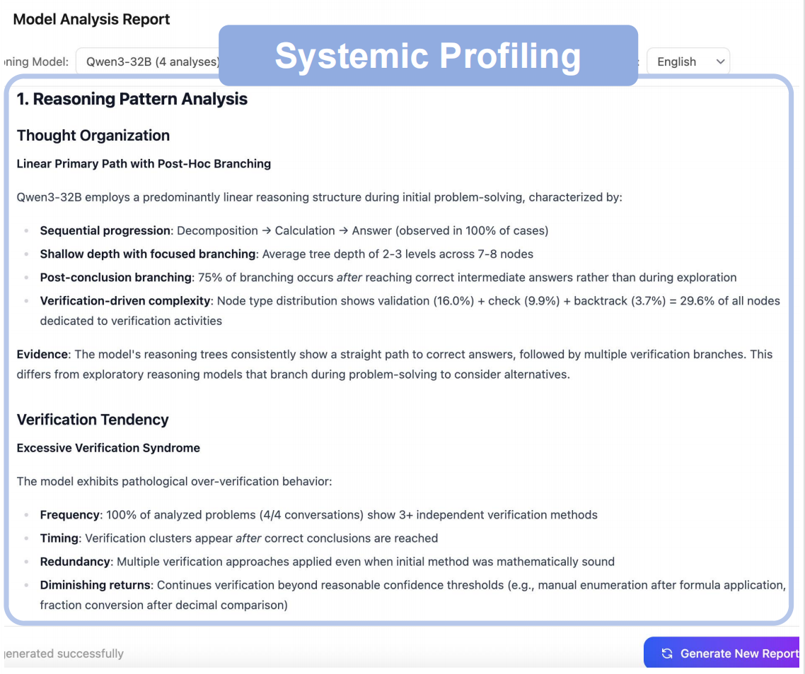

# 🔍 REASONINGLENS：大型推理模型的层级可视化与诊断审计

<div align="center">


[](LICENSE)
[](https://www.python.org/)
[](https://nodejs.org/)

[安装](#安装) · [系统概览](#系统概览) · [许可证](#许可证)

[**English**](README.md) | [**🇨🇳 中文文档**](README_CN.md)

</div>

---

> **TL;DR:** 长链推理（CoT）是一把双刃剑。虽然 OpenAI o1 和 DeepSeek-R1 等模型比以往更强，但调试一条 10,000 token 的推理轨迹依旧像噩梦。**ReasoningLens** 将这堵“文字墙”转化为可交互的层级推理可视化图。

## 问题：当透明度变成负担

**大型推理模型（LRMs）** 时代已经到来。我们受益于它们的自我纠错与规划能力，但也遇到了新的难题：**要理解模型究竟是*如何*得到结论，正变得越来越困难。**

当模型输出超长推理轨迹时，真正关键的逻辑往往被大量重复的过程步骤淹没。想定位一次幻觉、一次策略转向，几乎像在大海里找针。

## ReasoningLens 简介

ReasoningLens 基于 **[Open WebUI](https://github.com/open-webui/open-webui.git)** 构建，是一套面向开发者的工具链，帮助开源社区在不被长链推理“劝退”的前提下，**可视化、理解并调试**模型推理过程。

> **“ReasoningLens 不只展示模型说了什么，更展示模型是*如何思考*的。”**

---

## 系统概览


REASONINGLENS 由三个核心模块组成：

### 1. 层级可视化（Hierarchical Visualization）

大部分 CoT token 属于“执行层”（算数、替换、展开），而真正决定方向变化的“策略层”只占少数。ReasoningLens 的目标是把信号从噪声里分离出来：

- **规划单元切分：** 自动识别“等等我再检查一下…”“或者换一种思路…”等策略转折词。
- **宏观视图（Exploration）：** 一眼看清模型在哪回溯、在哪验证、在哪受阻。
- **微观视图（Exploitation）：** 仅在需要时下钻到具体计算或符号替换细节。

<div align="center">

</div>

---

### 2. 智能体诊断（Agentic Diagnosis）

推理更长不一定更好。“长度扩展”可能引入更隐蔽的幻觉与漂移。ReasoningLens 的 **Agentic Diagnosis** 将推理轨迹当作可审计对象进行系统化诊断：

- **⚡ 分批分析：** 高效处理超长轨迹，兼顾规模与上下文连续性。
- **🧠 滚动摘要记忆：** 记住前文关键状态，识别跨段落的逻辑漂移与不一致。
- **🧮 工具增强校验：** 集成计算器自动核验算术步骤，减少“低级数学错误”漏检。

---

### 3. 系统画像（Systemic Profiling）

单次调试有价值，但系统性模式更关键。ReasoningLens 会跨会话聚合数据，形成模型层面的稳定画像：

1. **聚合（Aggregate）：** 收集不同任务域（编程、数学、逻辑）的推理轨迹。
2. **压缩（Compress）：** 将重复模式提炼为紧凑的记忆状态。
3. **报告（Report）：** 输出结构化 Markdown 报告，标出模型“盲区”与“稳定优势”。

<div align="center">

</div>

---

## 安装

### 先决条件

- **Python 3.11+**
- **Node.js 22.10+**
- **Docker / Docker Compose**（容器化部署）

---

## 快速开始

### 方式 1：本地开发

#### 克隆仓库

```bash
git clone https://github.com/icip-cas/ReasoningLens.git
cd ReasoningLens
```

#### 2. 后端配置

```bash
cd backend

# 创建并激活 conda 环境
conda create --name open-webui python=3.11
conda activate open-webui

# 安装依赖
pip install -r requirements.txt -U

# 启动后端服务
sh dev.sh
```

后端运行地址：`http://localhost:8080`

#### 3. 前端配置

打开一个新终端：

```bash
# 安装前端依赖
npm install --force

# 启动开发服务器
npm run dev
```

前端运行地址：`http://localhost:5173`

### 方式 2：Docker Compose（推荐）

#### 快速启动

```bash
# 添加执行权限
chmod +x dev-docker.sh

# 启动开发环境
./dev-docker.sh
```

该脚本会自动完成：

- 清理旧容器
- 创建必要的数据卷
- 同时启动前端与后端服务

**访问地址：**

- 🌐 前端：`http://localhost:5173`
- 🔧 后端：`http://localhost:8080`

#### Docker 常用命令

```bash
# 查看全部日志
docker-compose -f docker-compose.dev.yaml logs -f

# 仅查看后端日志
docker-compose -f docker-compose.dev.yaml logs -f backend

# 仅查看前端日志
docker-compose -f docker-compose.dev.yaml logs -f frontend

# 停止所有服务
docker-compose -f docker-compose.dev.yaml down

# 重启后端
docker-compose -f docker-compose.dev.yaml restart backend

# 重启前端
docker-compose -f docker-compose.dev.yaml restart frontend
```

### 方式 3：Docker 构建（生产环境）

#### 构建 Docker 镜像

```bash
# 基础构建（仅 CPU）
docker build -t reasoning-lens:latest .

# 启用 CUDA 支持构建
docker build --build-arg USE_CUDA=true -t reasoning-lens:cuda .

# 集成 Ollama 构建
docker build --build-arg USE_OLLAMA=true -t reasoning-lens:ollama .

# 精简版构建（不预下载模型）
docker build --build-arg USE_SLIM=true -t reasoning-lens:slim .
```

#### 构建参数

| 参数                  | 默认值                                   | 说明                                      |
| --------------------- | ---------------------------------------- | ----------------------------------------- |
| `USE_CUDA`            | `false`                                  | 启用 CUDA/GPU 支持                        |
| `USE_CUDA_VER`        | `cu128`                                  | CUDA 版本（如 `cu117`、`cu121`、`cu128`） |
| `USE_OLLAMA`          | `false`                                  | 在镜像中包含 Ollama                       |
| `USE_SLIM`            | `false`                                  | 跳过预下载嵌入模型                        |
| `USE_EMBEDDING_MODEL` | `sentence-transformers/all-MiniLM-L6-v2` | RAG 的句子向量模型                        |
| `USE_RERANKING_MODEL` | `""`                                     | RAG 的重排序模型                          |

#### 运行容器

```bash
# 运行容器
docker run -d \
  --name reasoning-lens \
  -p 8080:8080 \
  -v reasoning-lens-data:/app/backend/data \
  reasoning-lens:latest

# 使用 GPU 支持运行
docker run -d \
  --name reasoning-lens \
  --gpus all \
  -p 8080:8080 \
  -v reasoning-lens-data:/app/backend/data \
  reasoning-lens:cuda
```

#### 环境变量

| 变量                  | 说明                                  |
| --------------------- | ------------------------------------- |
| `OPENAI_API_KEY`      | 你的 OpenAI API Key                   |
| `OPENAI_API_BASE_URL` | 自定义 OpenAI 兼容 API 端点           |
| `WEBUI_SECRET_KEY`    | 会话管理密钥                          |
| `DEFAULT_USER_ROLE`   | 新用户默认角色（`user` 或 `admin`）   |

## 开发

### 项目结构

```text
reasoning-lens/
├── backend/                 # Python backend (FastAPI)
│   ├── open_webui/          # 主应用
│   │   ├── routers/         # API 路由
│   │   ├── models/          # 数据模型
│   │   └── utils/           # 工具模块
│   └── requirements.txt     # Python 依赖
├── src/                     # Svelte 前端
│   ├── lib/                 # 共享组件
│   └── routes/              # 页面路由
├── static/                  # 静态资源
├── Dockerfile               # 生产镜像构建文件
├── docker-compose.dev.yaml  # 开发环境 compose 文件
```

### 技术栈

- **后端**：Python 3.11+, FastAPI, SQLAlchemy
- **前端**：Svelte 5, TypeScript, TailwindCSS
- **数据库**：SQLite（默认）, PostgreSQL（可选）
- **容器化**：Docker, Docker Compose

## 许可证

本项目采用 MIT License，详见 [LICENSE](LICENSE)。

## 引用

如果 ReasoningLens 对你的研究有帮助，欢迎引用：

```bibtex
@software{Zhang_ReasoningLens_2026,
  author = {Zhang, Jun and Zheng, Jiasheng and Lu, Yaojie and Cao, Boxi},
  license = {MIT},
  month = feb,
  title = {{ReasoningLens}},
  url = {https://github.com/icip-cas/ReasoningLens},
  version = {0.1.0},
  year = {2026}
}
```

## 团队与贡献

- **Jun Zhang** - 主要贡献者
- **Jiasheng Zheng** - 贡献者
- **Yaojie Lu** - 贡献者
- **Boxi Cao** - 项目负责人

## 致谢

感谢 **[Open WebUI](https://github.com/open-webui/open-webui.git)** 社区以及所有早期用户和贡献者的反馈与支持。我们期待与开源社区一起持续完善 ReasoningLens。

## 加入我们

有问题或想交流想法？欢迎在 GitHub 提交 Issue 或参与社区讨论。让我们一起打造更强大的推理调试工具。